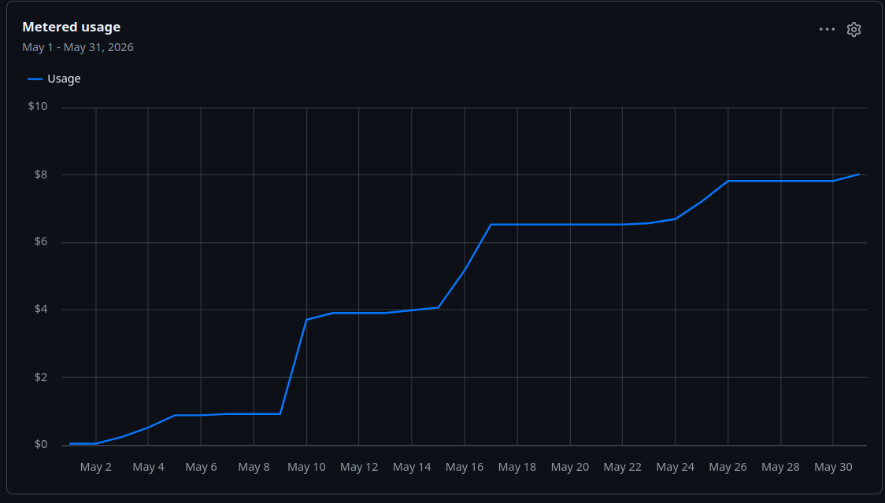
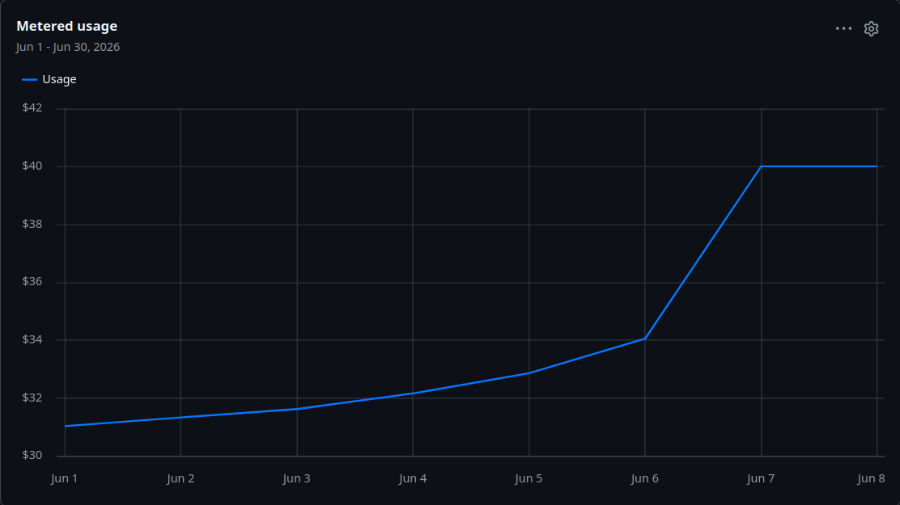
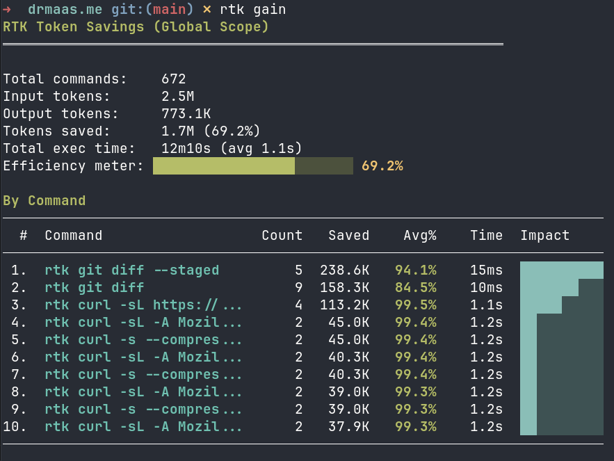

As a cost-conscious software engineer, I'm always looking for ways to do more with less. Copilot used to be a great option, but with their new credit system — not anymore. Read on to see how their new credit system works, details about my new dev setup, and how I save money when I use AI at home.

## Background

When I started using GitHub Copilot about a year ago, it was basically free. They had a very generous free tier and didn't count usage very aggressively. I was able to use `opus 4.5` for days on end without exceeding the limits. When I finally did, I switched to `Sonnet` or `auto` to keep costs as low as possible. Usually the bills came to less than $15. I also tried `raptor mini` and `GPT 5o mini` for light tasks since they're free, but my results were mixed, so I stopped.

Below is my May usage report. I ended up at almost $9 after some fairly heavy usage on `auto`, including some Playwright browser tooling that tends to chew through tokens.

_
GitHub Copilot May 2026 usage report showing $8.00 in charges
_

## The Problem

When June started, I assumed the credits would translate into the same cost. Wrong! See below:

_
Oops I'm now over $30 for the billing cycle
_

Keep in mind my billing cycle ends on the 10th of each month. I kept using Copilot models (`Sonnet 4.6` and `auto`) and easily hit $40 before my self-imposed quota kicked in.

Since I was in the middle of a task and already pretty sure I didn't want to stay on Copilot, I added [OpenRouter](https://openrouter.ai) as a provider, still on `Sonnet 4.6`. I ripped through another $10 on a large refactor. While Anthropic model pricing is similar across providers, OpenRouter uses a variety of hosting platforms to offer models at cost — meaning prices can drop when a provider lowers theirs. They also offer hundreds of models, including powerful open-source ones that cost a fraction of Anthropic's.

## The Solution

So I switched to `DeepSeek V4 Flash` and my output cost dropped from `$15/M tokens` to `$0.20/M tokens`, without much dropoff in quality. It's hard to put a concrete number on it, but the coding agent only needed slightly more guidance — well worth the savings.

## Tooling

The coding agent I used throughout this exercise was [OpenCode](https://github.com/opencodeco). I like the running cost total it shows for each session, along with the rather verbose output — I like to actually read what the agent is doing sometimes. It also helps me catch it when it starts spinning. Several times, the agent correctly decided to patch out-of-date npm dependencies, though in most cases it was just to silence warnings. I decided those warnings were better left alone instead of applying patches I wouldn't remember anything about in a day or two.

I also use [rtk](https://github.com/rtk-ai/rtk) to save on context usage. RTK installs as an agent hook that tells agents to intercept common commands and run them through the `rtk` command-line proxy. I estimate about 5% of my context runs through rtk, and of that, I save about 70%, leading to a total savings of 3–4% without losing any functionality.

*
Total savings using RTK
*

## Summary

After this weekend's exercise, my setup changed a bit. It felt good to revisit old decisions, clean up cruft (I'm looking at you, oh-my-opencode), and harden my new stack.

Here's a summary of what I'm running now:

- **Harnesses**: usually OpenCode, sometimes Copilot CLI, rarely VS Code Copilot.
- **Model providers**: OpenRouter, considering OpenCode Zen.
- **Agents**: usually just the built-in plan, implement, review. I try to keep it simple.
- **MCPs**: depends on the project's tech stack, but I try to use MCPs or CLI tools + skills for every system dependency.
- **Skills**: [context7](https://context7.com/), git, frontend design, Playwright CLI, skill creator. Installed via [skills.sh](https://www.skills.sh).
- **CLI tools**: RTK, ripgrep, and a few others agents like to use. Try asking an LLM what tools you should have installed for maximum efficiency. 